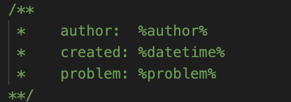
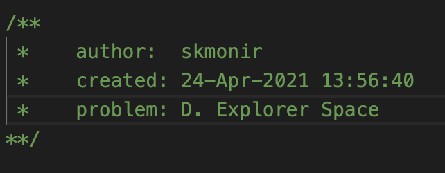

'mango' is a task parser and tester for popular online judge 'Codeforces'. It supports the regular contest and gym.

INSTALLATION:
Windows:
1. Keep 'mango.exe' in any folder you prefer
2. Add the folder path from step 1 to System Variable Path

Mac:
1. Keep 'mango' executable file at /usr/local/bin folder
2. Change the permission of the file by 'chmod +x mango' command.

Linux:
...

3. Set default programs to open .cpp & .json files
4. Open cmd from anywhere and run 'mango configure'. It will open config.json file. Configure as you prefer. But DO NOT CHANGE the OJ and Host property.

5. Set 'Workspace' as the full path of the folder where all of the contest sources and testcases will be stored
6. Set 'TemplatePath' as the full path of your template file.
7. Set 'Author' as your username/handle or anything name you prefer. It will be used in your template(if any).
8. If you have 'TemplatePath' with a template file, then few key texts of the template will be replaced as follows...
        KEY       |       REPLACED BY
--------------------------------------------
    %author%      |  'Author' mentioned in step 7
    %problem%     |  'Problem Name' if the Problem is parsed by 'parse' or 'create' command
    %datetime%    |  'Current date and time' in format '2-Jan-2006 15:04:05'
Example: 

 
9. Enjoy!

AVAILABLE COMMANDS:

1. mango setc 1521 // sets current working contest
2. mango configure // opens the config.json file to update & save configuration

3. mango parse 1521 // step 1 + parses samples of all the problems for specified contest ID
4. mango parse 1521A // step 1 + parses samples of Problem A for specified contest ID

5. mango source 1521A // creates source file of Problem A for specified contest ID
6. mango source A // creates source file of Problem A for current working contest ID

7. mango open 1521 // opens all the source files in the default editor for specified contest ID
8. mango open 1521A // opens source file of Problem A in the default editor for specified contest ID
9. mango open A // opens source file of Problem A in the default editor for current working contest ID

10. mango create 1521 // combination of steps (1, 3, 5, 7) for specified contest ID
11. mango create 1521A // combination of steps (1, 4, 6, 8) for Problem A

12. mango compile 1521A // / compiles source file of Problem A for specified contest ID
13. mango compile A // compiles source file of Problem A for current working contest ID

14. mango test 1521A // step 12 + tests Problem A for specified contest ID
15. mango test A // step 13 + tests Problem A for current working contest ID