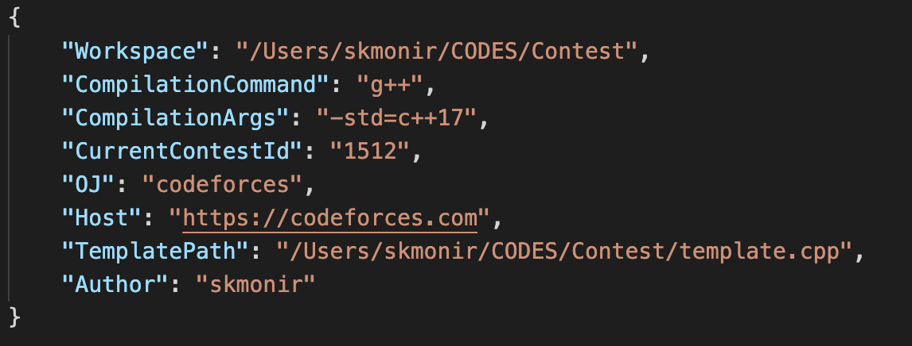

# Introduction
'mango' is a CLI based task parser and tester for popular online judge 'Codeforces'. It supports the regular contest and gym.

# Installation
Windows: 
1. Keep 'mango.exe' in any folder you prefer
2. Add the folder path from step 1 to System Variable Path. (How to add path in System Var? See here: https://www.architectryan.com/2018/03/17/add-to-the-path-on-windows-10/)

Mac: 
1. Keep 'mango' executable file at /usr/local/bin folder
2. Change the permission of the file by 'chmod +x mango' command.

Linux: 
May be similar to mac. Didn't try in linux.

# Configuration
1. Set default programs to open .cpp & .json files. (How to change default programs in windows? See here: https://www.digitaltrends.com/computing/how-to-change-file-associations/)
2. Open cmd prompt from anywhere and run 'mango configure'. It will open config.json file. Or go to AppData>Roaming>mango, you'll find the config.json file. Now configure as you prefer. But DO NOT CHANGE the OJ and Host property.

3. Set 'Workspace' as the full path of the folder where all of the contest sources and testcases will be stored
4. Set 'TemplatePath' as the full path of your template file. If you ommit TemplatePath, a default template will be created for the source file.
5. Set 'Author' as your username/handle or anything name you prefer. It will be used in your template.
6. Enjoy!

# Command Format
`mango <command> <argument>`

=> Only `configure` and `version` commands don't need any argument. 
=> For other comamnds, the argument format is `<contest_id><problem_id>`. But both `<contest_id>`and `<problem_id>` are optional for corresponding command.

# Available Commands as example
1. `mango setc 1521`: sets current working contest
2. `mango configure`: opens the config.json file to update & save configuration

3. `mango parse 1521`: command 1 + parses samples of all the problems for specified contest ID
4. `mango parse 1521A`: command 1 + parses samples of Problem A for specified contest ID

5. `mango source 1521A`: creates source file of Problem A for specified contest ID
6. `mango source A`: creates source file of Problem A for current working contest ID

7. `mango open 1521`: opens all the source files in the default editor for specified contest ID
8. `mango open 1521A`: opens source file of Problem A in the default editor for specified contest ID
9. `mango open A`: opens source file of Problem A in the default editor for current working contest ID

10. `mango create 1521`: combination of commands (1, 3, 5, 7) for specified contest ID
11. `mango create 1521A`: combination of commands (1, 4, 6, 8) for Problem A

12. `mango compile 1521A`: compiles source file of Problem A for specified contest ID
13. `mango compile A`: compiles source file of Problem A for current working contest ID

14. `mango test 1521A`: command 12 + tests Problem A for specified contest ID
15. `mango test A`: command 13 + tests Problem A for current working contest ID
